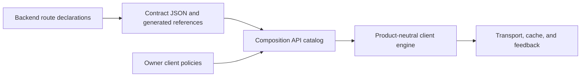

# Suite API client specification

Status: accepted direction, consolidated from the [Suite API client map](MAP.md) and its closed [decision tickets](tickets/008-migration-and-verification.md). This document defines the target caller contract. The [implementation plan](suite-api-client-plan.md) owns the migration order. The [caller prototype](tickets/007-cross-product-caller-prototype.md) established the syntax, not production transport guarantees.

Where the tickets leave mechanics open, this spec chooses compatible implementation defaults: opaque cache partitions, per-consumer cancellation, call-order ordinary mutations, and the state signatures below. These details require production verification; the prototype did not prove them.

## 1. Boundary and references

`@/api` is the one ordinary caller entry. It exports `api`, `client`, `useQuery`, `useMutation`, `useInfiniteQuery`, and `useUpload`. `api.suite`, `api.drive`, and `api.mail` group references by owner. Public names use resource nouns and clear actions: `api.drive.nodes.get`, `api.drive.nodes.rename`, `api.suite.people.list`. A caller passes a reference directly. It does not build a descriptor or attach product policy.

Each generated operation has an explicit `query` or `mutation` kind and public reference name. One backend route can generate several operations when its body is a union. For example, node patch variants produce distinct rename, move, and trash references. The route may declare names for each variant. The exporter preserves each existing operation ID and HTTP URL. It emits owner, kind, input and output types, declared refusals, validation, entity metadata, and server paging or byte facts. An owner registration may supply paging behavior that the server contract does not declare. HTTP method does not imply kind: a visit record is a mutation even if its response is small. A query API rejects mutation references at typecheck time. Duplicate public names, missing kinds, and incompatible metadata fail contract generation. See [operation kinds](tickets/002-operation-kinds-and-references.md) and [catalog ownership](tickets/003-catalog-and-product-ownership.md).

Generated files contain server facts. Product client modules own request scope, cache effects, optimism, membership, and challenge policy. Composition registers these policies once. The product-neutral engine imports no product, shell, or composition module. A lightweight owner API entry exposes references without loading product UI, editor sessions, or all validators and policies at startup. A caller's import does not construct per-call wrappers.



## 2. Calls and failures

The following signatures are compatible implementation defaults for the accepted caller convention. They do not claim approval of these exact declarations. `NoInfer` keeps an argument from widening its generated reference's input type.

```ts
import type { MaybeRefOrGetter } from 'vue'
import type { MutationRef, PageRef, QueryRef, TransferRef } from '@/platform/transport'

type ObserveArgs<I> = {} extends I
  ? [input?: MaybeRefOrGetter<NoInfer<I> | false>]
  : [input: MaybeRefOrGetter<NoInfer<I> | false>]
interface ReadOptions {
  cache?: 'prefer'
  signal?: AbortSignal
}
interface WriteOptions {
  silent?: boolean
  signal?: AbortSignal
}
type CallArgs<I, Options> = {} extends I
  ? [input?: NoInfer<I>, options?: Options]
  : [input: NoInfer<I>, options?: Options]
declare function useQuery<I, O>(ref: QueryRef<I, O>, ...args: ObserveArgs<I>): QueryState<O>
declare function useInfiniteQuery<I, Row>(ref: PageRef<I, Row>, ...args: ObserveArgs<I>): InfiniteQueryState<Row>
declare function useMutation<I, O>(ref: MutationRef<I, O>, options?: { silent?: boolean }): MutationState<I, O>
declare function useUpload<I, O>(ref: TransferRef<I, O>, options?: { silent?: boolean }): UploadState<I, O>
declare const client: {
  query<I, O>(ref: QueryRef<I, O>, ...args: CallArgs<I, ReadOptions>): Promise<O>
  mutation<I, O>(ref: MutationRef<I, O>, ...args: CallArgs<I, WriteOptions>): Promise<O>
}

interface QueryState<T> {
  readonly data: T | undefined
  readonly status: 'pending' | 'success' | 'error'
  readonly isFetching: boolean
  readonly error: Error | null
  refetch(): Promise<T | undefined>
  cancel(): void
}
interface InfiniteQueryState<Row> {
  readonly rows: readonly Row[]
  readonly hasNext: boolean
  readonly isFetchingNext: boolean
  readonly error: Error | null
  fetchNext(): Promise<void>
  cancel(): void
}
interface MutationState<I, O> {
  readonly isPending: boolean
  readonly error: Error | null
  run(...args: {} extends I ? [input?: NoInfer<I>] : [input: NoInfer<I>]): Promise<O>
  reset(): void
  cancel(): void
}
interface UploadState<I, O> extends MutationState<I, O> {
  readonly progress: number | null
}
```

```ts
import { ref } from 'vue'
import { api, client, useInfiniteQuery, useMutation, useQuery, useUpload } from '@/api'

function useCrossProductCalls(file: Blob) {
  const selected = ref<string | null>(null)
  const account = useQuery(api.suite.account.get)
  const inbox = useQuery(api.mail.inbox.summary)
  const people = useInfiniteQuery(api.suite.people.list, { q: 'a' })
  const node = useQuery(api.drive.nodes.get, () =>
    selected.value ? { node: selected.value } : false,
  )
  const rename = useMutation(api.drive.nodes.rename)
  const upload = useUpload(api.drive.uploads.transfer)
  async function save() {
    await rename.run({ node: 'budget', title: 'Forecast.xlsx' })
    await upload.run({ parent_node: 'root', file })
    return client.query(api.suite.people.list, { q: 'a' }, { cache: 'prefer' })
  }
  return { selected, account, inbox, people, node, save }
}
```

The example runs in Vue setup with `file: Blob` available. It shows caller shape, not a claim that the mock prototype proved production behavior.

The actual overloads infer input and output from the reference. A reference with no required input may omit it. A reference with required input cannot. Reactive inputs accept a plain value, a Vue ref, or a getter. A getter returning `false`, or a literal `false`, disables either query form. Disabled queries make no request, expose `data: undefined` or empty rows, and clear fetching state. Their `refetch()` resolves `undefined`. An active failed refetch rejects. When inputs change, the observer follows the new key and ignores late replies for the old key. Disposal of a Vue effect scope removes its observers. Outside a component, `client` works without a Vue scope.

Reactive reads may show cached data immediately, then revalidate. An imperative `client.query` fetches from the server by default; `cache: 'prefer'` permits a valid cached result. Equivalent concurrent requests can share one in-flight fetch. An awaited read or explicit refetch rejects on failure. A reactive query also records the failure in `error`. A canceled request does not become a user-facing error.

An owner workflow may supply a `RequestContext` to an imperative read or either mutation form. The context supplies an opaque `partition()` and a fresh `scope()` for the request; it does not put credentials in caller arguments or cache keys. Editors use their Drive document session's context for ordinary document calls through this same engine. A mutation may also request `keepalive` when its save workflow needs it. These options preserve protocol requirements without creating another ordinary request API.

`useMutation(ref).run(input)` and `client.mutation(ref, input)` execute the same scope, validation, optimistic update, normalization, rollback, effects, and feedback pipeline. Both reject on failure. A reactive mutation also records the error. Expected server refusals remain generated types carried by `TransportError`, with `type` and `status`; callers narrow with `instanceof TransportError` and branch on `type`, not message text. Invalid input, missing registration, and broken response contracts may be `TypeError` or another `Error`. Do not disguise them as expected refusals. If a challenge handler does not produce success, the awaited call rejects with its original refusal. The default mutation error feedback may be suppressed locally with `silent` when the caller presents an inline refusal. Feedback never converts rejection into success. This replaces the current `undefined` result on a failed write; every migrated caller must fix its success and refusal paths. See [call semantics](tickets/004-call-and-error-semantics.md).

Cancellation is owned per consumer. Disabling, disposing, or canceling one observer detaches that observer and must not abort another observer or an imperative caller sharing the fetch. Abort the underlying request only when no interested consumer remains. An enabled query may reattach on `refetch()`; reactive input changes also reenable it. An imperative signal cancels its own wait. A canceled awaited call rejects with `AbortError`. It clears pending state, records no refusal error, shows no refusal toast, and rolls back only that attempt's optimism. Cancellation does not promise that a server write already sent was undone. A canceled caller cannot publish a late result into its old observer. Read retries remain limited to safe transport conditions; canceled work stops retrying. Writes receive no automatic retry without server idempotency support.

## 3. Cache, scope, and effects

One client instance owns one query cache, in-flight map, normalized entity store, persistence, and realtime integration. The cache identity includes the stable operation ID, canonical request arguments, and an opaque access partition. The partition reflects the current session and the effective product access scope. It must distinguish Drive requests whose selected share links change access, without storing raw link codes, unlock tickets, or headers in cache keys or persisted entity records. A policy computes and changes the partition; the engine uses it for query records, normalized entities, and persisted entities. On sign-out, user switch, or access-scope change, old partitions become unreadable immediately and their in-flight replies cannot repopulate the active partition. Persistent storage is cleared or namespaced so the next identity never hydrates previous data. See [cache and policies](tickets/005-cache-and-product-policies.md).

Response entity declarations come from the server contract. Owner policies define list membership, touched entities, optimistic fields, invalidation, and cross-product effects. Every mutation declares effects or explicit `none`; a CI coverage check rejects an omission. `none` is valid only after its readers and side effects have been checked. Visit updates must affect Recent, settings changes their readers, and share-link changes access-sensitive data. The engine does not refresh every query for an owner as a fallback.

Ordinary mutations run in call order through the current serialization queue; transfer work may run alongside. A refusal rolls back its own optimism, so a failed write cannot erase a later successful update. A stale server reply cannot replace a newer committed value. A successful mutation reconciles its returned entities, applies membership rules and declared effects, then schedules affected refetches. Its promise resolves after local reconciliation; it does not wait for every list and does not promise synchronized database snapshots. Realtime events enter the same identity-aware reconciliation path.

Drive policy selects links for named and covered nodes, enforces existing link limits, and handles access changes and challenges. Request scope is captured before the first attempt, including its generation and sent ticket. Its outcome callback runs once after the final retry attempt and does not run on abort. A stale generation cannot alter the current link store. These rules apply to both caller forms and preserve the behavior of the existing Drive link store; they are not just header injection.

## 4. Pages, transfers, and protocols

`useInfiniteQuery(ref, input)` accepts only a query reference with page capability. It exposes typed `rows`, `hasNext`, `isFetchingNext`, `error`, `fetchNext()`, and `cancel()`. It accepts reactive arguments and `false` as above. Its cursor or offset details come from generated metadata or one owner registration. The caller supplies domain arguments and does not assemble a descriptor. Argument or access-partition changes reset that observer's page sequence. A stale page cannot append to the new sequence. List membership and mutation effects apply to loaded pages. Disabled state or cursor exhaustion makes `fetchNext()` a no-op.

`useUpload(ref)` accepts only a declared transfer reference, such as `api.drive.uploads.transfer`. Its `run(input)` accepts a `Blob` plus typed domain fields and optional resume state. It exposes `isPending`, `error`, `progress`, `cancel()`, and the typed final result. Progress is `null` before a run and a percentage from 0 to 100 during transfer. The owner workflow owns session creation, chunk or direct-byte requests, finish, progress, resume offsets, cancellation, request scope, cleanup, and effects. Failures reject and retain enough session state for supported resume. The exact workflow stays with the product because upload protocols differ. A download is an explicit byte-returning operation, with `Blob` output and no entity normalization. A byte capability does not create a third operation kind. Product composite work, including document creation and failed-import cleanup, remains a named owner workflow built from client calls. Yjs, WebRTC, and long-lived streams retain separate protocol clients. See [paging and exceptional operations](tickets/006-paging-uploads-and-exceptions.md).

## 5. Acceptance and limits

Acceptance checks use the public interface against independently stated outcomes. Valid references infer required arguments and outputs; wrong kinds and shapes fail compilation. A changed or disabled selection never shows a late old result. Two consumers share a fetch without one canceling the other. Imperative reads fetch unless cache reuse is explicit. Both write forms reject refusals, roll back their own optimism, and update detail, lists, and realtime views under the same policies. Identity and Drive link changes isolate both query records and persisted entities. Upload resume, progress, cancel, and byte download work against their real protocols. The [migration contract](tickets/008-migration-and-verification.md) sets the full gates.

This client does not add database dependency tracking, synchronized query snapshots, automatic write retries, or a general action kind. It does not redesign HTTP resource URLs, permissions, product workflows, collaboration, or media protocols. The prototype's mock visit and settings `none` policies are not production policy decisions.
